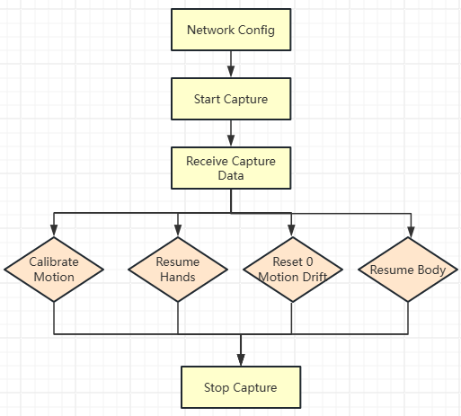
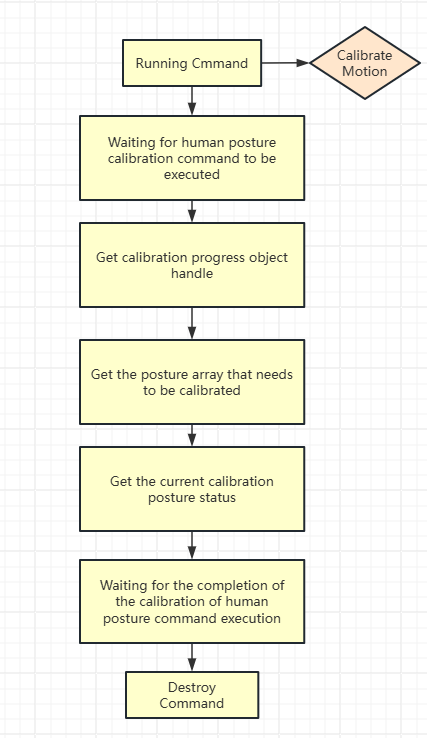

# PN-Link Python操作文档

## 介绍

PN-Link是诺亦腾公司推出的全身有线惯性动作捕捉产品，身体上各个子节点的数据通过有线汇总到主节点（身体背部的一个设备），最后通过网络发送到上位机。

PN-Link与其他无线惯性动捕产品不同，它提供了一种新的连接模式（直连模式），使用者可以不用安装诺亦腾公司提供的上位机软件Axis Studio，而是通过mocapApi sdk直连PN-Link主节点，完成数据采集，人体姿态校准等操作。

本工程演示了如何使用python调用MocapApi sdk直连PN-Link主节点，完成上述功能。

工程包含的文件列表：

- mocap_api.py： mocapApi的python接口类
- mocap_main_base.py：  调用 mocapApi 接口的实现基类 。
- mocap_main.py：  从PN-Link获取数据,通过控制台交互完成相关指令功能。
- mocap_main_robot_ros2.py： 从PN-Link获取数据，retargeting后通过ros2 发布订阅消息。
- mocap_main_stickman_ros2.py: 从PN-Link获取数据, 通过ROS2 发布关节状态消息，并使用 TF（Transform）库来创建和可视化火柴人模型。

> 其中，mocap_main.py，mocap_main_robot_ros2.py，mocap_main_stickman_ros2.py是三个独立启动app。后两者包含了mocap_main.py的功能，增加了基于ros2的发布不同订阅消息的功能。

## 环境准备

1. 安装 Python 3.x 及以上版本。

2. 安装所需库： docutils、pynput。

3. PN-Link 有线套装

5. 执行mocap_main_robot_ros2 和 mocap_main_stickman_ros2 确保已安装ROS2 环境。

   

##  网络配置

PN-Link主节点默认设置了固定IP：10.42.0.202，并监听UDP端口：8080

因此需要将运行当前工程脚本的机器IP设置为同网段，如：10.42.0.101

对应的设置代码示例如下：

```python
class MCPBase:
    def __init__(self):
        self.app = MCPApplication()  # 创建应用实例
        settings = MCPSettings()  # 创建设置实例
        
        # 配置 BVH 数据格式为二进制
        settings.set_bvh_data(MCPBvhData.Binary)
        # 启用 BVH 数据转换
        settings.set_bvh_transformation(MCPBvhDisplacement.Enable)
        # 设置旋转顺序为 YZX
        settings.set_bvh_rotation(MCPBvhRotation.YZX)
        # 配置 UDP 数据传输地址和端口
        settings.SetSettingsUDPEx('10.42.0.101', 8002)
        settings.SetSettingsUDPServer('10.42.0.202', 8080)
        
        # 将设置应用到应用实例并打开连接
        self.app.set_settings(settings)
        self.app.open()
```


## 指令

### 指令执行顺序

- 创建网络链接
- 执行采集指令
- 打印采集数据 
- 执行其他指令
- 停止采集



### 指令执行流程

- 创建指令 
- 执行指令 
- 等待指令执行完成 
- 销毁指令


### 校准流程



~~~python
def handleRunning(self, commandRespond):
        # 处理校准进度句柄
        _calibrateProgressHandle = MCPCommand().get_progress(commandRespond._commandHandle)
        progressHandle = MCPCalibrateMotionProgress(_calibrateProgressHandle)
        count = progressHandle.get_count_of_support_poses()

        str_poses = "Support poses:"
        for i in range(count):
            name = progressHandle.get_name_of_support_poses(i)
            str_poses += name
            if i + 1 != count:
                str_poses += ", "
        str_poses += " : "     
        
        # 获取校准步骤和校准名称
        result_current_step, result_p_name = progressHandle.get_step_current_pose()
        if result_current_step == MCPCalibrateMotionProgressStep.CalibrateMotionProgressStep_Countdown:
            # 获取校准倒计时
            result_countdown, result_p_name = progressHandle.get_countdown_current_pose()
            str_poses += (f"Calibration-({result_p_name})-Countdown {result_countdown}.")
        elif result_current_step == MCPCalibrateMotionProgressStep.CalibrateMotionProgressStep_Progress:
            # 获取校准进度
            result_progress, result_p_name = progressHandle.get_progress_current_pose()
            str_poses += (f"Calibration-({result_p_name})-Progress {result_progress}.")
        elif result_current_step == MCPCalibrateMotionProgressStep.CalibrateMotionProgressStep_Prepare:
            str_poses += (f"Calibration-({result_p_name}) is preparing.")
        else:
            str_poses += (f'Calibration-Unknown({result_current_step}) is running.')

        print(str_poses) 
~~~


## 基类（mocap_main_base.py）

- 调用 mocapApi 接口的实现类

### 1. 初始化

```python
class MCPBase:
    def __init__(self):
        # 初始化当前命令和运行命令状态
        self.current_command = -1  # 当前执行的命令
        self.capture_key = False  # 捕获状态标识
        self.connent_key = False  # 连接状态标识
        self.app = MCPApplication()  # 创建应用实例
        settings = MCPSettings()  # 创建设置实例
        
        # 配置 BVH 数据格式为二进制
        settings.set_bvh_data(MCPBvhData.Binary)
        # 启用 BVH 数据转换
        settings.set_bvh_transformation(MCPBvhDisplacement.Enable)
        # 设置旋转顺序为 YZX
        settings.set_bvh_rotation(MCPBvhRotation.YZX)
        # 配置 UDP 数据传输地址和端口
        settings.SetSettingsUDPEx('10.42.0.101', 8002)
        settings.SetSettingsUDPServer('10.42.0.202', 8080)
        
        # 将设置应用到应用实例并打开连接
        self.app.set_settings(settings)
        self.app.open()
```

### 2. 获取当前命令标题

```python
    def get_current_command_title(self):
        # 返回当前命令对应的标题
        if self.current_command == EMCPCommand.CommandStartCapture:
            return 'Start Capture'
        elif self.current_command == EMCPCommand.CommandStopCapture:
            return 'Stop Capture'
        elif self.current_command == EMCPCommand.CommandCalibrateMotion:
            return 'Calibrate Motion'
        elif self.current_command == EMCPCommand.CommandResumeOriginalHandsPosture:
            return 'Resume Hands'
        elif self.current_command == EMCPCommand.CommandClearZeroMotionDrift:
            return 'Reset 0 Motion Drift'
        else:
            return 'None'
```

### 3. 检查当前命令

```python
    def check_current_command(self, running_command):
        # 检查是否可以运行指定命令
        if self.connent_key == False:
            print('Link failure.')  # 打印未连接时的错误信息
            return False
        elif self.current_command != -1:
            # 如果有其他命令正在运行，禁止执行其他命令
            print(f'Pending command {self.get_current_command_title()} is running.')
            return False
        # 除了开始捕获命令外，其他命令需先开始捕获
        elif self.capture_key == False and running_command != EMCPCommand.CommandStartCapture:
            print('Please start capture command first.')
            return False
        return True
```

### 4. 执行命令

```python
    def running_command(self, running_command):
        # 执行指定命令
        if self.check_current_command(running_command) == True:
            self.app.queue_command(running_command)  # 执行命令
            self.current_command = running_command  # 更新当前命令
```

### 5. 处理通知事件

```python
    def handleNotify(self, notifyData):
        # 处理通知事件
        if notifyData._notify == MCPEventNotify.Notify_SystemUpdated:
            mcpSystem = MCPSystem(notifyData._notifyHandle)  # 获取系统信息
            print(f'MasterInfo : ( Version : {mcpSystem.get_master_version()}, SerialNumber : {mcpSystem.get_master_serial_number()} )')
```

### 6. 处理命令结果

```python
    def handleResult(self, commandRespond):
        # 处理命令结果
        command = MCPCommand()
        _commandHandle = commandRespond._commandHandle
        ret_code = command.get_result_code(_commandHandle)
        if ret_code != 0:
            ret_msg = command.get_result_message(_commandHandle)
            print(f'ResultCode: {self.get_current_command_title()}, ResultMessage: {ret_msg}')  # 打印命令执行错误信息
        else:
            print(f'{self.get_current_command_title()} done.')  # 打印命令执行成功信息
            if self.current_command == EMCPCommand.CommandStopCapture:
                self.capture_key = False
        command.destroy_command(_commandHandle)  # 销毁命令句柄
        self.current_command = -1  # 重置当前命令
```

### 7. 处理校准命令

```python
    def handleRunning(self, commandRespond):
        # 处理校准进度
        _calibrateProgressHandle = MCPCommand().get_progress(commandRespond._commandHandle)
        progressHandle = MCPCalibrateMotionProgress(_calibrateProgressHandle)
        count = progressHandle.get_count_of_support_poses()

        str_poses = "Support poses:"
        for i in range(count):
            name = progressHandle.get_name_of_support_poses(i)
            str_poses += name
            if i + 1 != count:
                str_poses += ", "
        str_poses += " : "     
        
        # 获取校准步骤和校准名称
        result_current_step, result_p_name = progressHandle.get_step_current_pose()
        if result_current_step == MCPCalibrateMotionProgressStep.CalibrateMotionProgressStep_Countdown:
            # 获取校准倒计时
            result_countdown, result_p_name = progressHandle.get_countdown_current_pose()
            str_poses += (f"Calibration-({result_p_name})-Countdown {result_countdown}.")
        elif result_current_step == MCPCalibrateMotionProgressStep.CalibrateMotionProgressStep_Progress:
            # 获取校准进度
            result_progress, result_p_name = progressHandle.get_progress_current_pose()
            str_poses += (f"Calibration-({result_p_name})-Progress {result_progress}.")
        elif result_current_step == MCPCalibrateMotionProgressStep.CalibrateMotionProgressStep_Prepare:
            str_poses += (f"Calibration-({result_p_name}) is preparing.")
        else:
            str_poses += (f'Calibration-Unknown({result_current_step}) is running.')

        print(str_poses)    
```

### 8. 异步更新

```python
    async def update(self):
        try: 
            # 异步更新函数，用于处理事件循环
            while True:
                evts = self.app.poll_next_event()  # 获取下一个事件
                for evt in evts:
                    self.connent_key = True
                    if evt.event_type == MCPEventType.AvatarUpdated:
                        if self.current_command != EMCPCommand.CommandCalibrateMotion:
                            self.capture_key = True
                            self.handleAvatar(evt.event_data.avatar_handle)
                    elif evt.event_type == MCPEventType.Notify:
                        self.handleNotify(evt.event_data.notifyData)
                    elif evt.event_type == MCPEventType.CommandReply:
                        if evt.event_data.commandRespond._replay == MCPReplay.MCPReplay_Response:
                            print('MCPReplay_Response')
                        elif evt.event_data.commandRespond._replay == MCPReplay.MCPReplay_Running:
                            self.handleRunning(evt.event_data.commandRespond)
                        elif evt.event_data.commandRespond._replay == MCPReplay.MCPReplay_Result:
                            self.handleResult(evt.event_data.commandRespond)
                    elif evt.event_type == MCPEventType.RigidBodyUpdated:
                        print('rigid body updated')
                await asyncio.sleep(0.1)  # 等待 0.1 秒
        except Exception as e:
            print(f"An error occurred: {e}")    
```

### 9. 主异步函数

```python
    async def main_async(self):
        # 主异步函数
        main = self
        loop = asyncio.get_event_loop()

        # 键盘事件处理函数
        def on_key_press(key):
            try:
                key_name = key.char.lower()
                print(f"Key pressed: {key_name}")
                if key_name == 'n':
                    main.running_command(EMCPCommand.CommandStartCapture)
                elif key_name == 'f':
                    main.running_command(EMCPCommand.CommandStopCapture)
                elif key_name == 'c':
                    main.running_command(EMCPCommand.CommandCalibrateMotion)
                elif key_name == 'r':
                    main.running_command(EMCPCommand.CommandResumeOriginalHandsPosture)     
                elif key_name == 'v':
                    main.running_command(EMCPCommand.CommandClearZeroMotionDrift)     
            except AttributeError:
                if key == key.esc:
                    print("ESC key pressed, exiting program")
                    return False  # 退出监听器

        # 启动键盘监听器
        with Listener(on_press=on_key_press) as listener:
            asyncio.run_coroutine_threadsafe(main.update(), loop)  # 启动事件更新
            print("Press N to Start Capture, F to Stop Capture, C to calibrate, R to Resume Hands, V to Reset 0 Motion Drift, press ESC to exit program")
            await loop.run_in_executor(None, listener.join)  # 等待监听器退出
```

## 处理PN-Link数据并打印（mocap_main.py）

- 从PN-Link获取数据,并打印数据信息

### 1. 初始化

```python
class MCPMain(MCPBase):
    def __init__(self):
        super().__init__()
```

### 2. 处理PN-Link采集数据

- 获取PN-Link采集数据并打印

```python
    def handleAvatar(self, avatar_handle):
        # 处理角色更新事件
        avatar = MCPAvatar(avatar_handle)  # 获取角色数据
        joints = avatar.get_joints()  # 获取所有关节数据
        str_data = '{'
        for joint in joints:
            link_name = joint.get_name()  # 获取关节名称
            position = joint.get_local_position()  # 获取关节位置
            rotation = joint.get_local_rotation()  # 获取关节旋转
            str_data += f'{link_name} : {position}, {rotation}'
        str_data += '}'
        print(f"links_data: {str_data}")  # 打印关节数据
```

### 3. 主函数

```python
    def main(self):
        asyncio.run(self.main_async())

if __name__ == '__main__':
    MCPMain().main()
```

## ROS2 消息发布类（mocap_main_robot_ros2.py）

- ROS2 URDF 启动和配置请参考链接： [GitHub - pnmocap/mocap_ros_urdf: This is a URDF (Unified Robot Description Format) project used to define the structure and joint information of robots.](https://github.com/pnmocap/mocap_ros_urdf)

### 1. 初始化

```python
class MCPMainRobotROS2(MCPBase):
    def __init__(self):
        super().__init__()
        rclpy.init()
        self.node = Node("json_to_joint_state_publisher")
        self.publisher = self.node.create_publisher(JointState, "/joint_states", 10)
        json_file_path = './retarget.json'
        self.robot = MCPRobot(open(json_file_path).read())
        # 从 JSON 文件加载关节名称
        with open(json_file_path, 'r') as file:
            data = json.load(file)
        self.joint_names = data['urdfJointNames']  
```

### 2. 处理PN-Link数据并发布 ROS2 消息

```python
    def handleAvatar(self, avatar_handle):
        try:
            # 处理角色更新事件
            avatar = MCPAvatar(avatar_handle)  # 获取角色数据
            self.robot.update_robot(avatar)
            self.robot.run_robot_step()
            # print(robot.get_robot_ros_frame_json())

            # 从机器人获取实时数据
            real_time_data = json.loads(self.robot.get_robot_ros_frame_json()[0])

            # 创建 JointState 消息
            joint_state_msg = JointState()
            joint_state_msg.header.stamp = self.node.get_clock().now().to_msg()
            joint_state_msg.name = self.joint_names

            # 初始化关节位置
            joint_positions = [0.0] * len(self.joint_names)

            # 用实时数据填充关节位置
            for i, name in enumerate(self.joint_names):                    
                if name in real_time_data['joint_positions']:
                    joint_positions[i] = real_time_data['joint_positions'][name]

            joint_state_msg.position = joint_positions
            self.publisher.publish(joint_state_msg)

            # print(f"Joint positions: {joint_positions}")

        except Exception as e:
            print(e)
```

### 3. 主函数

```python
    def main(self):
        asyncio.run(self.main_async())
        
if __name__ == '__main__':
    MCPMainRobotROS2().main()  # 启动主程序
```

## 通过 ROS2 TF 生成火柴人（mocap_main_stickman_ros2.py）

- ROS2 启动火柴人配置请参考链接： [GitHub - pnmocap/mocap_ros_urdf: This is a URDF (Unified Robot Description Format) project used to define the structure and joint information of robots.](https://github.com/pnmocap/mocap_ros_urdf)


### 1. 初始化

```python
class MCPMainStickmanROS2(MCPBase):
    def __init__(self):
        super().__init__()
        rclpy.init()
        self.node = Node("real_time_transform_publisher")
        self.br = StaticTransformBroadcaster(self.node)  
```

### 2. 定义每个关节的父子关系

~~~
# 定义每个链接的父子关系
links_parent = {
    "Hips": "world",
    "RightUpLeg": "Hips",
    "RightLeg": "RightUpLeg",
    "RightFoot": "RightLeg",
    "RightTiptoe": "RightFoot",
    "LeftUpLeg": "Hips",
    "LeftLeg": "LeftUpLeg",
    "LeftFoot": "LeftLeg",
    "LeftTiptoe": "LeftFoot",
    "Spine": "Hips",
    "Spine1": "Spine",
    "Spine2": "Spine1",
    "Neck": "Spine2",
    "Neck1": "Neck",
    "Head": "Neck1",
    "Head1": "Head",
    "RightShoulder": "Spine2",
    "RightArm": "RightShoulder",
    "RightForeArm": "RightArm",
    "RightHand": "RightForeArm",
    "RightHandThumb1": "RightHand",
    "RightHandThumb2": "RightHandThumb1",
    "RightHandThumb3": "RightHandThumb2",
    "RightInHandIndex": "RightHand",
    "RightHandIndex1": "RightInHandIndex",
    "RightHandIndex2": "RightHandIndex1",
    "RightHandIndex3": "RightHandIndex2",
    "RightInHandMiddle": "RightHand",
    "RightHandMiddle1": "RightInHandMiddle",
    "RightHandMiddle2": "RightHandMiddle1",
    "RightHandMiddle3": "RightHandMiddle2",
    "RightInHandRing": "RightHand",
    "RightHandRing1": "RightInHandRing",
    "RightHandRing2": "RightHandRing1",
    "RightHandRing3": "RightHandRing2",
    "RightInHandPinky": "RightHand",
    "RightHandPinky1": "RightInHandPinky",
    "RightHandPinky2": "RightHandPinky1",
    "RightHandPinky3": "RightHandPinky2",
    "LeftShoulder": "Spine2",
    "LeftArm": "LeftShoulder",
    "LeftForeArm": "LeftArm",
    "LeftHand": "LeftForeArm",
    "LeftHandThumb1": "LeftHand",
    "LeftHandThumb2": "LeftHandThumb1",
    "LeftHandThumb3": "LeftHandThumb2",
    "LeftInHandIndex": "LeftHand",
    "LeftHandIndex1": "LeftInHandIndex",
    "LeftHandIndex2": "LeftHandIndex1",
    "LeftHandIndex3": "LeftHandIndex2",
    "LeftInHandMiddle": "LeftHand",
    "LeftHandMiddle1": "LeftInHandMiddle",
    "LeftHandMiddle2": "LeftHandMiddle1",
    "LeftHandMiddle3": "LeftHandMiddle2",
    "LeftInHandRing": "LeftHand",
    "LeftHandRing1": "LeftInHandRing",
    "LeftHandRing2": "LeftHandRing1",
    "LeftHandRing3": "LeftHandRing2",
    "LeftInHandPinky": "LeftHand",
    "LeftHandPinky1": "LeftInHandPinky",
    "LeftHandPinky2": "LeftHandPinky1",
    "LeftHandPinky3": "LeftHandPinky2"
}
~~~


### 3. 处理PN-Link数据并发布 ROS2 TF 消息

```python
def handleAvatar(self, avatar_handle):
        try:
            # 处理角色更新事件
            avatar = MCPAvatar(avatar_handle)  # 获取角色数据

            # 获取所有关节数据
            joints = avatar.get_joints()
            for joint in joints:
                link_name = joint.get_name()  # 获取关节名称
                position = joint.get_local_position()  # 获取关节位置
                rotation = joint.get_local_rotation()  # 获取关节旋转

                # 为每个关节创建并发送变换
                self.send_transform(link_name, position, rotation)

            # Head1 的特殊处理
            rotation = (0.0, 0.0, 0.0, 1.0)
            position = (0.000000, 16.450001, 0.000000)
            self.send_transform('Head1', position, rotation)

            # 左右脚趾的特殊处理
            position = (0.000000, -7.850000, 14.280000)
            self.send_transform('LeftTiptoe', position, rotation)
            self.send_transform('RightTiptoe', position, rotation)

            # 处理机器人的根关节
            root_joint = avatar.get_root_joint()
            position = root_joint.get_local_position()
            rotation = root_joint.get_local_rotation()

            # 发布根关节的变换
            self.send_transform('base_link', position, rotation, frame_id='world')

        except Exception as e:
            print(f"处理角色时出错: {e}")

    def send_transform(self, child_frame_id, position, rotation, frame_id=None):
        try:
            if frame_id is None:
                frame_id = links_parent[child_frame_id]  # 获取父框架ID

            t = TransformStamped()  # 创建TF消息
            t.header.stamp = self.node.get_clock().now().to_msg()  # 设置时间戳
            t.header.frame_id = frame_id  # 设置父框架ID
            t.child_frame_id = child_frame_id  # 设置子框架ID

            # 设置平移
            t.transform.translation.x = position[2] / 100
            t.transform.translation.y = position[0] / 100
            t.transform.translation.z = position[1] / 100

            # 设置旋转
            t.transform.rotation.x = rotation[3]
            t.transform.rotation.y = rotation[1]
            t.transform.rotation.z = rotation[2]
            t.transform.rotation.w = rotation[0]

            self.br.sendTransform(t)  # 发送TF消息
        except Exception as e:
             print(f"Error sending transform for {child_frame_id}: {e}")

```

### 4. 主函数

```python
    def main(self):
        asyncio.run(self.main_async())

if __name__ == '__main__':
    MCPMainStickmanROS2().main()
```

